# Chapter 16 Authentication and Authorization
# Application running
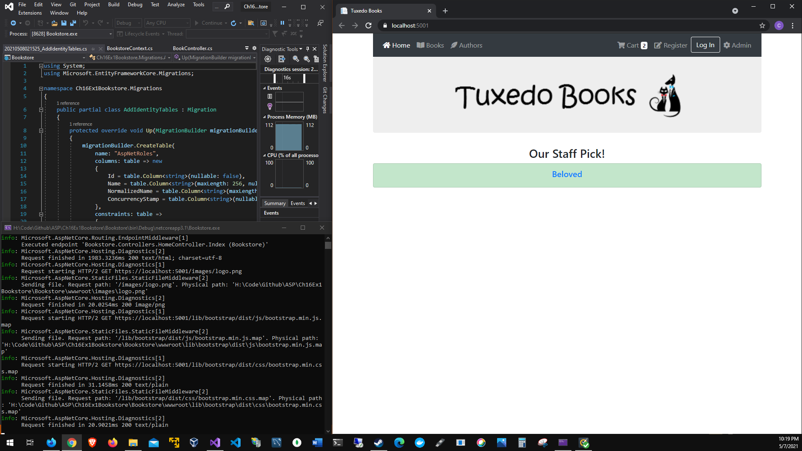
# Update database
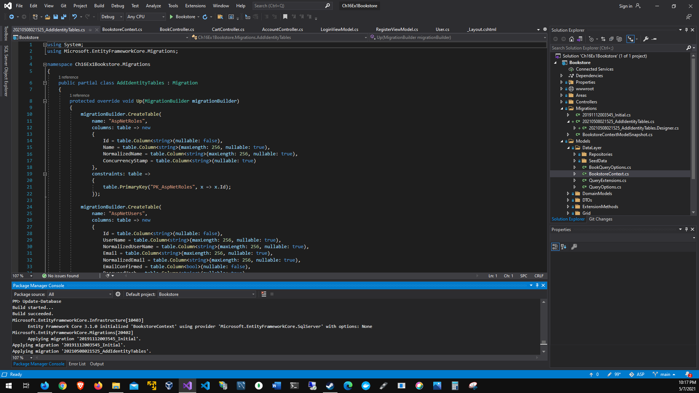
# Add migration
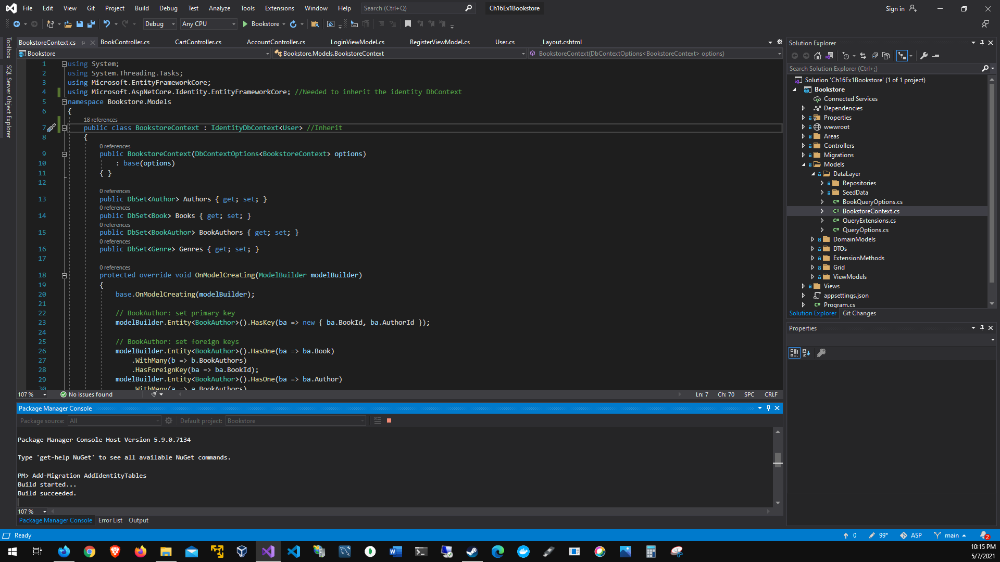
# Test cart
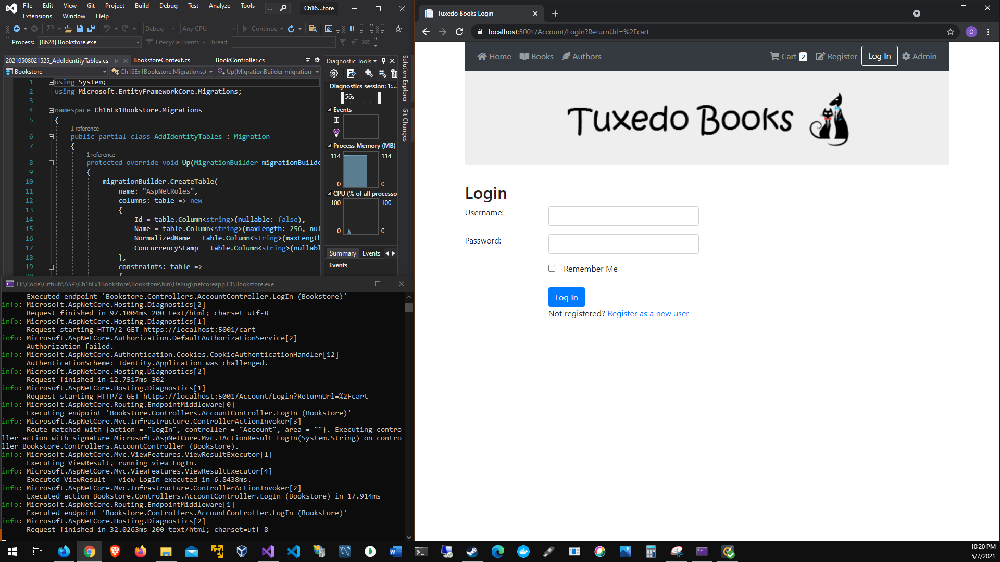
# Register 
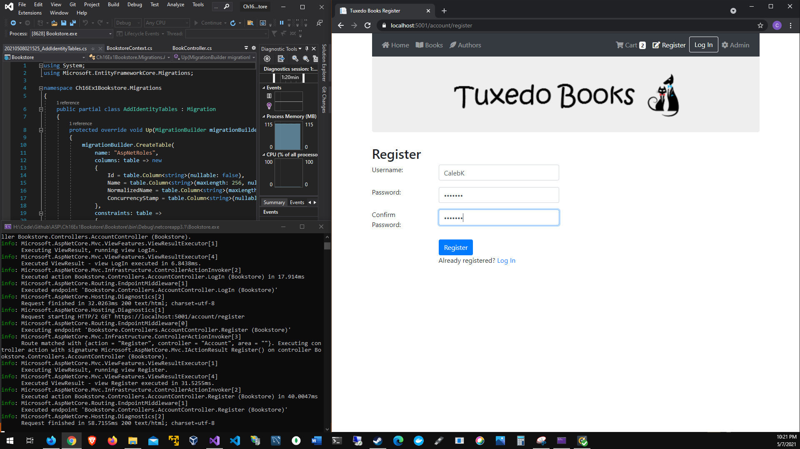
# View cart
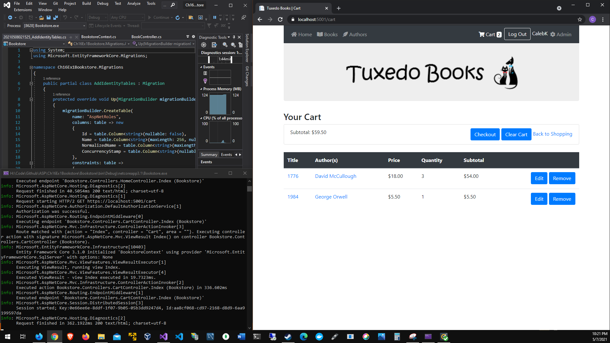
# Denied Admin
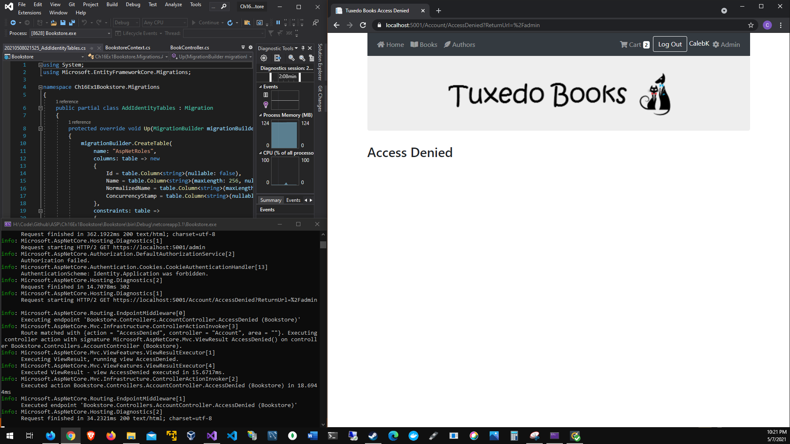
# Log out
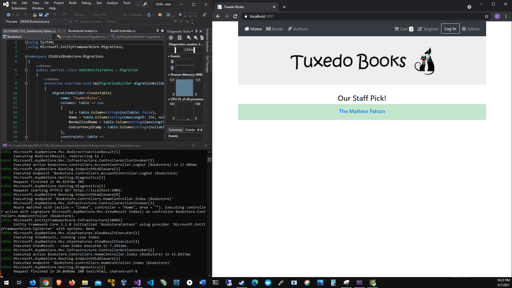
# Add new migration
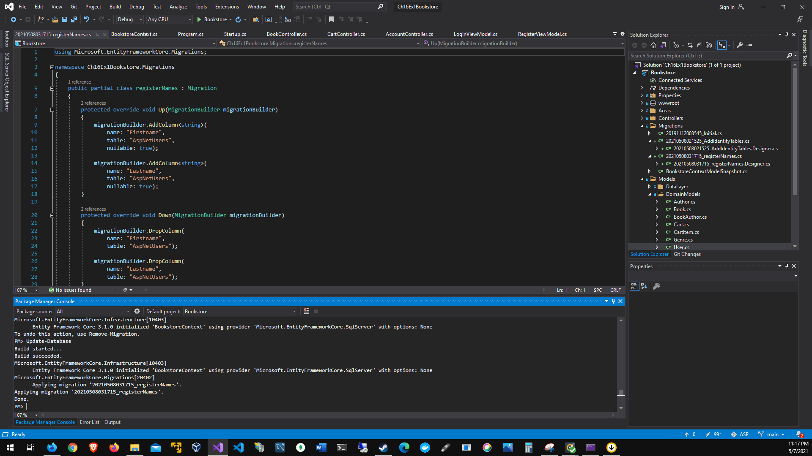
# Admin Login
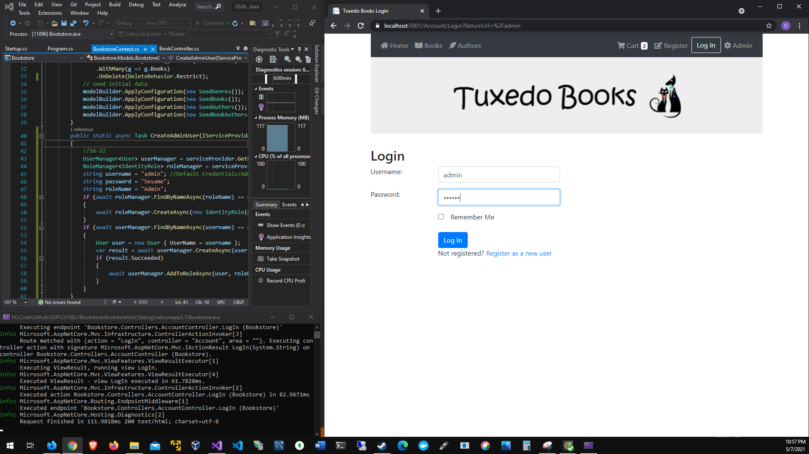
# Logged in Admin
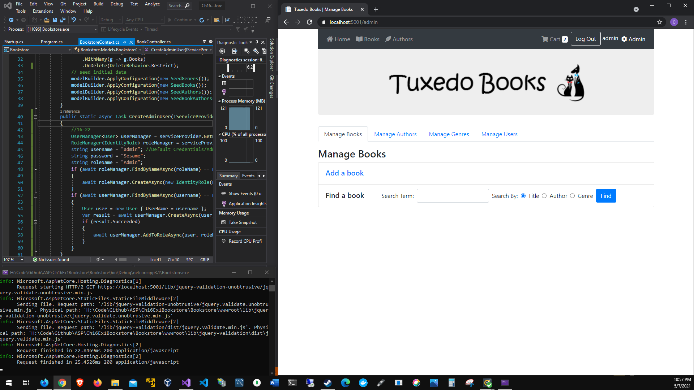
# Manage users
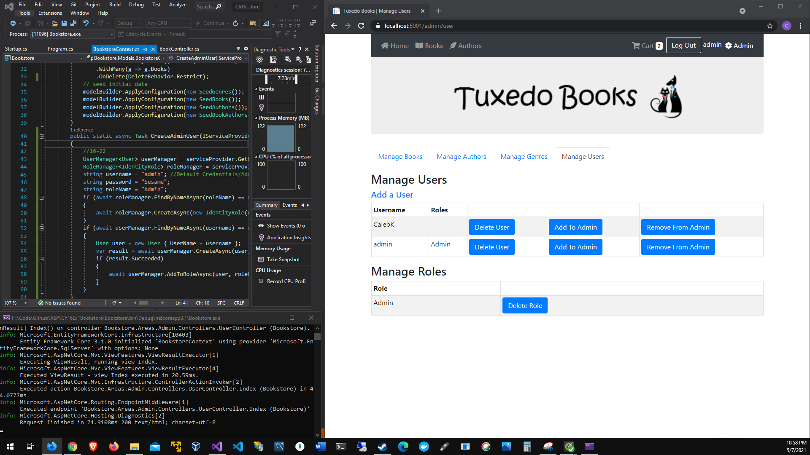
# Final register
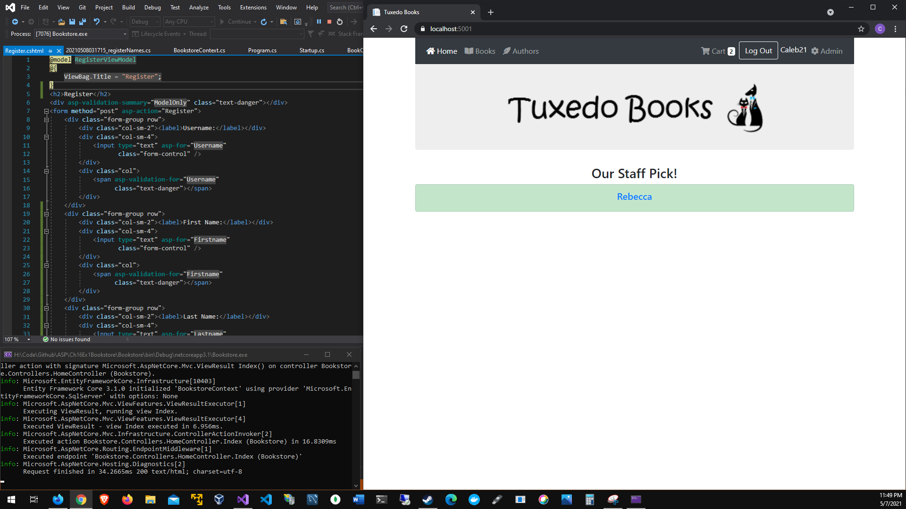
# Final register form
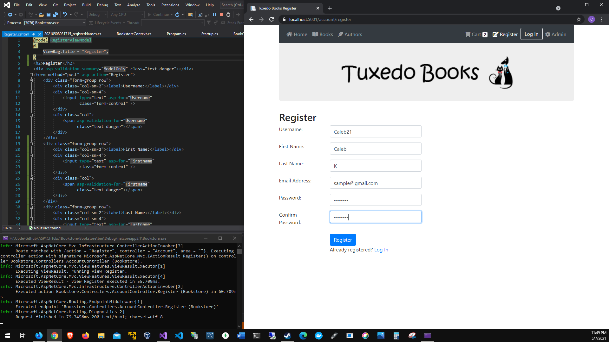